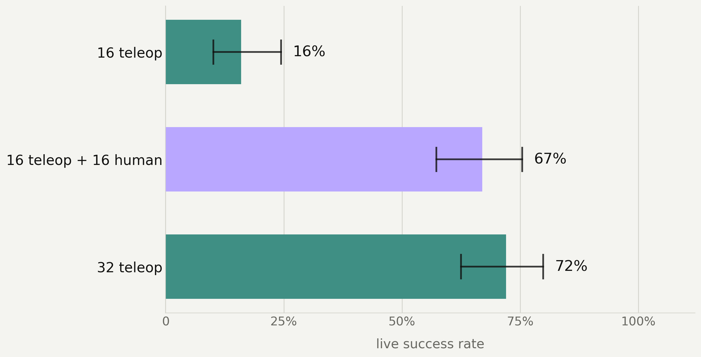
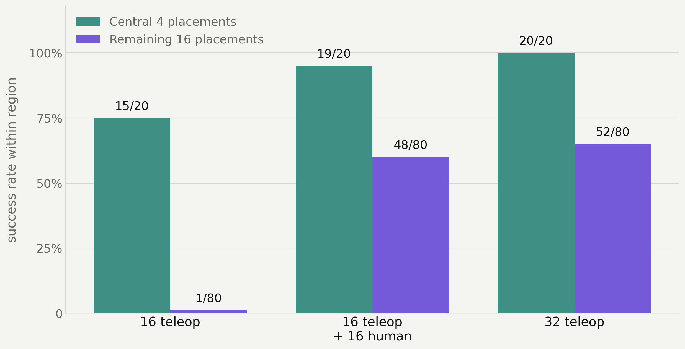
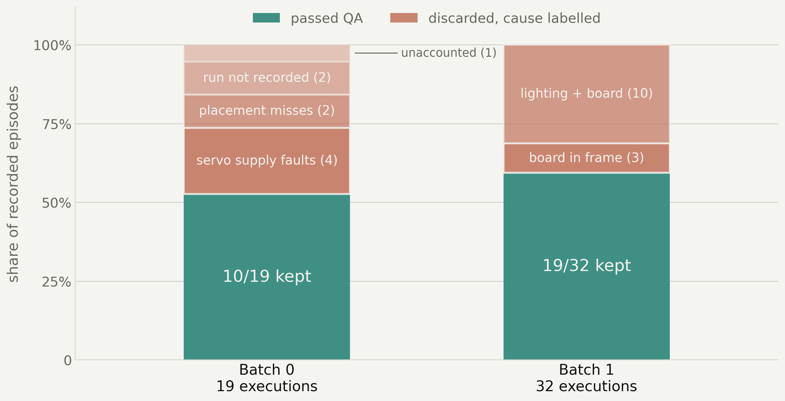

# Can handheld demonstrations replace robot teleoperation?

Training data for manipulation policies is expensive because collecting it ties
up a robot and an operator. This repository holds the models, datasets and raw
evaluation records from a controlled test of a cheaper alternative: recording
demonstrations **by hand**, with a GoPro on a gripper mock-up, and retargeting
them into the robot's joint space.

**Yes, at matched count.** Sixteen handheld demonstrations recovered about nine
tenths of what a second robot teleoperation session bought — on fewer training
frames, and with no robot tied up to collect them.

## The question, stated precisely

> **16 teleoperated demonstrations + 16 converted from handheld video
> ≈ 32 teleoperated demonstrations?**

Answering that needs three policies, not two: without the 16-teleop baseline,
65% against 70% is ambiguous — either the handheld half did real work, or 16
teleoperated episodes already reached 65% on their own and the handheld half
contributed nothing. The baseline separates those readings, and it is the row
that makes the comparison mean anything.

## The comparison

Three ACT policies share a training recipe exactly — 50,000 steps, batch 8,
seed 1000, one wrist camera at 10 fps — and differ only in training data. Task:
pick a small box from a 20-square grid and place it on a target, scored live by
a human on the same placements.

| training data | checkpoint | frames | measured success | 95% interval |
|---|---|---|---|---|
| 16 teleop | [`act_so101_t16b`](https://huggingface.co/robotfuel/act_so101_t16b) | 5,600 | 17% (2/12) † | 5–45% |
| 16 teleop + 16 handheld | [`act_so101_t16b_u16`](https://huggingface.co/robotfuel/act_so101_t16b_u16) | 9,376 | **65% (13/20)** | 43–82% |
| 32 teleop | [`act_so101_t16b_t16`](https://huggingface.co/robotfuel/act_so101_t16b_t16) | 11,200 | 70% (14/20) † | 48–85% |

† Measured on a separately trained arm of the same teleop episode count, not on
that exact checkpoint. Only the middle row was scored on the published
checkpoint. A 12-attempt session on the 32-teleop condition scored 75%; both
are on the record.

Doubling teleoperation moved success from 17% to 70%. Replacing that second
half with handheld data reached 65% — and did so on **16% fewer training
frames**, because handheld episodes run shorter than teleoperated ones.

The top two rows are statistically indistinguishable at this sample size, which
is the point: the substitution is not measurably worse. The gap that *is*
resolved is the one against the baseline — 17% to 65% — and it is what the
handheld data bought.

A later 10-placement session on a rebuilt scene put the handheld arm at 60%,
consistent with the 65%.



*Charts show the larger 100-attempt campaign; the table above shows the
20-attempt sessions whose per-attempt records are committed here. The two agree
within five points on every arm.*

The gain is concentrated where the baseline is weakest. The teleop-only policy
is competent in the middle of the workspace and collapses outside it; almost
all of the handheld arm's advantage comes from the outer placements.



*Central 4 placements versus the remaining 16. The teleop-only baseline scores
1/80 outside the centre; adding handheld data takes that to 48/80.*

## What is published

**Models** — three ACT policies, identical recipe, one variable.

- [`robotfuel/act_so101_t16b`](https://huggingface.co/robotfuel/act_so101_t16b) — 16 teleop, the shared base
- [`robotfuel/act_so101_t16b_u16`](https://huggingface.co/robotfuel/act_so101_t16b_u16) — + 16 handheld
- [`robotfuel/act_so101_t16b_t16`](https://huggingface.co/robotfuel/act_so101_t16b_t16) — + 16 teleop

**Datasets** — the source pools and the exact training mixtures.

- [`so101_retargeted_umi`](https://huggingface.co/datasets/robotfuel/so101_retargeted_umi) — 48 handheld demonstrations, retargeted
- [`so101_pick_place_50_20260917_v3`](https://huggingface.co/datasets/robotfuel/so101_pick_place_50_20260917_v3) — 50 teleoperated episodes
- [`so101_t16b`](https://huggingface.co/datasets/robotfuel/so101_t16b) · [`so101_t16b_u16`](https://huggingface.co/datasets/robotfuel/so101_t16b_u16) · [`so101_t16b_t16`](https://huggingface.co/datasets/robotfuel/so101_t16b_t16) — the three training sets

**Records** — [`evalsessions/`](evalsessions/) holds the operator's scoring log,
one directory per session, one JSON object per attempt with its placement,
measured brightness and verdict.

## Run a policy

```bash
pip install lerobot==0.6.1
```

```python
from lerobot.policies.act.modeling_act import ACTPolicy

policy = ACTPolicy.from_pretrained("robotfuel/act_so101_t16b_u16")
policy.eval()

# observation.state: (6,) joint positions in degrees
# observation.images.wrist: (3, 480, 640) uint8
action = policy.select_action(observation)   # (6,) target joint positions
```

## Reproduce the numbers

Every rate quoted above is recomputed from the raw records by:

```bash
python3 verify_results.py
```

It checks thirteen claims and exits non-zero if any stops reproducing.

## How attempts were scored

The box is placed by hand at a prescribed grid coordinate, the arm is homed and
held under torque, and the episode runs 35 seconds to completion without
intervention. An attempt succeeds if the box ends on the target, including a
scrappy recovery.

Two details matter for reading the numbers:

**Skips leave the denominator.** Scene brightness is measured before every
attempt. Attempts outside the trained lighting range, rig faults and interrupted
runs are recorded as skipped or void, not as failures — they never put the
policy in front of the box. Counting them as failures would silently deflate
every rate.

**Pooling is by placement, not by attempt.** One sitting ran 12 attempts across
11 distinct coordinates. Each coordinate contributes one outcome, so a repeated
square cannot be weighted double against a 20-placement plan.



No episode in any batch was discarded because the retargeting itself failed.

## Do not rank these policies by action error

Held-out action error — how closely a policy reproduces the demonstrator's
joint trajectory on unseen episodes — is cheap, reproducible, and **wrong
here**. The three arms score 3.07°, 2.82° and 2.20°. Calibrated on the teleop
pair, the handheld arm's 0.25° gap predicts roughly 33% success. It measured
65%.

A policy can track a trajectory closely and still fail to close the gripper, and
the converse. Ranking these three arms by action error inverts the bench result.
Rank on the bench.

## Media

- [`assets/pipeline-montage.mp4`](assets/pipeline-montage.mp4) — handheld capture through to robot execution
- [`assets/so101-selected-candidate-playback.mp4`](assets/so101-selected-candidate-playback.mp4) — a retargeted episode replayed on the arm

## Limitations

One task, one arm, one operator, one training seed per condition. Sample sizes
of 12–20 attempts separate 17% from 65% comfortably but do not separate 65%
from 70%. Retargeting fidelity has not been measured directly against
teleoperated trajectories. Nothing here has been tested on a second robot, a
second task, or a second scene.

This result is at **matched count** — sixteen handheld episodes against sixteen
teleoperated ones. Whether the substitution keeps paying as the handheld set
grows is a separate question, still under evaluation, and no claim about it is
made here.

The retargeting pipeline is not included. These are its outputs.

## License

Apache-2.0.
